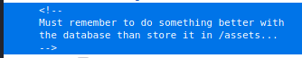
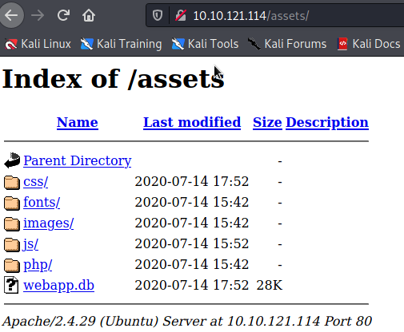
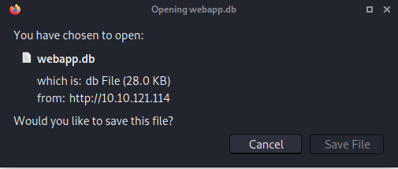
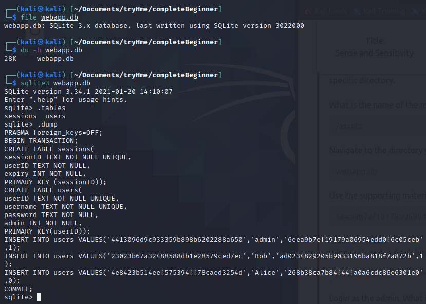
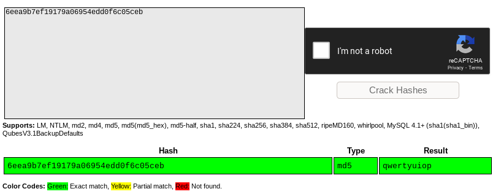
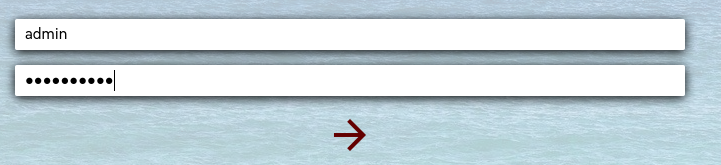
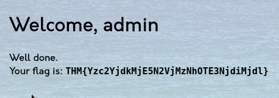

1. Upon inspection of elements, found the developers note on the login page

2. Moved to the assets directory and found the sensitive flat-file "webapp.db"

3. Downloaded the flat-file and checked it's size in human readable format

4. Opened the falt file to check it's tables and decided to dump it's contents as it was only a 26kb file 

6. Found the admins hash and then cracked the has to get the plain-text password on [Crackstation](https://crackstation.net)

7. Logged in as admin and captured the flag. Challenge completed

